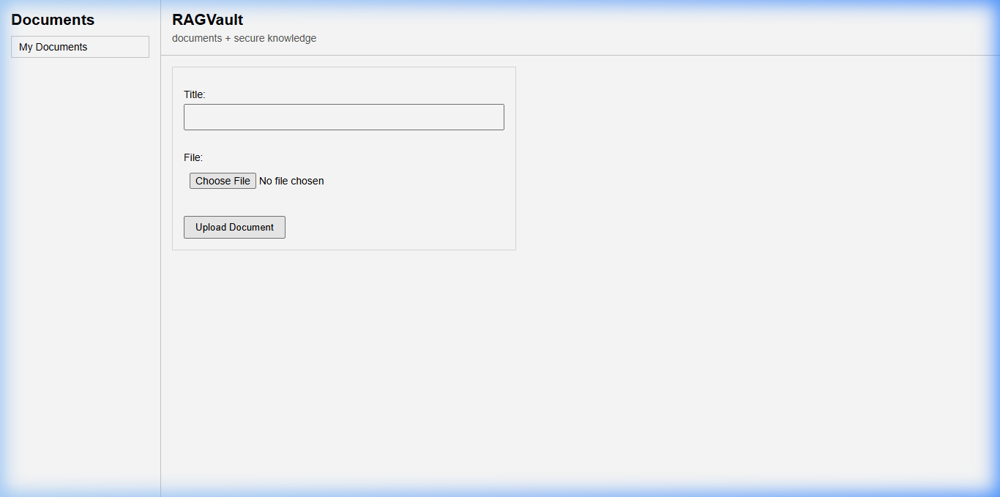
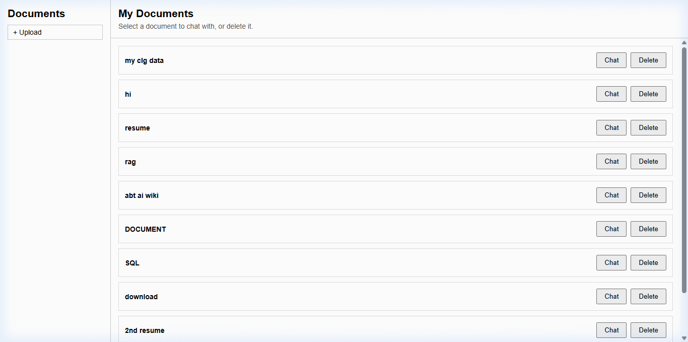
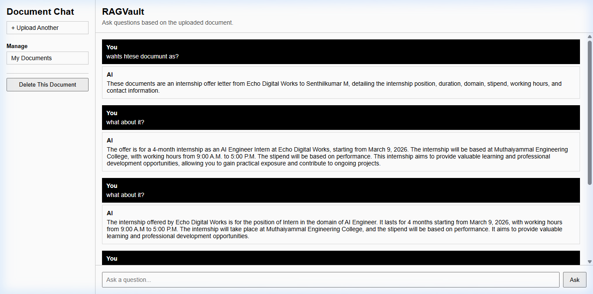
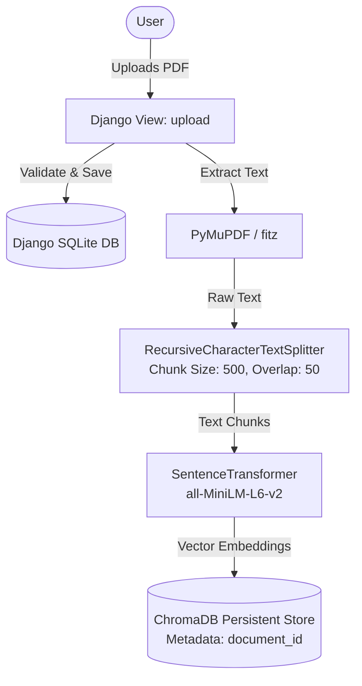
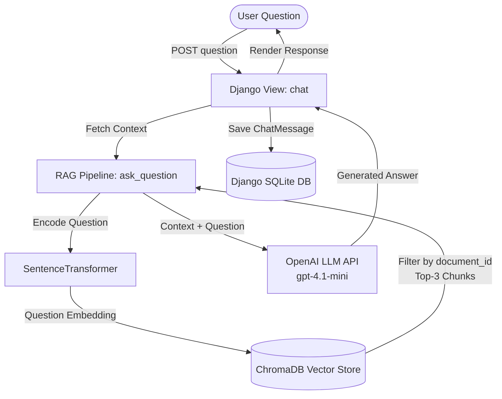

# RAGVault - AI-Powered Document Question Answering System

RAGVault is a Retrieval-Augmented Generation (RAG) web application built with **Django**, **ChromaDB**, **Sentence Transformers**, and the **OpenAI API**. It allows users to upload PDF documents, index their contents as vector embeddings, and interactively query specific documents using semantic similarity search coupled with Large Language Model (LLM) text generation.

---

## Overview

Traditional Large Language Models (LLMs) suffer from context window constraints and knowledge cutoffs. Passing entire documents into an LLM prompt is inefficient, expensive, and often exceeds token limits. Additionally, LLMs without grounded context can generate hallucinations.

**Retrieval-Augmented Generation (RAG)** solves these challenges by combining information retrieval with text generation:
1. **Retrieval**: When a user asks a question, the system searches a vector store for the exact passages in the document that are semantically most relevant to the question.
2. **Augmentation & Generation**: The retrieved text chunks are injected into the LLM prompt as context, instructing the model to synthesize a precise answer strictly grounded in the document.

---

## Application Screenshots

### 1. Document Upload

Users can upload a PDF document for processing.



### 2. Document Management

Users can view, chat with, and delete uploaded documents.



### 3. RAG Chat

Users can ask questions about the selected document and view persistent conversation history.



---

## Key Features

- 📄 **PDF Document Upload & Format Validation**: Upload PDF files with automatic extension validation (`.pdf` format check).
- 🔍 **Automated Text Extraction**: Extracts text from uploaded PDFs using PyMuPDF (`fitz`). Validates that PDFs contain extractable text.
- ✂️ **Recursive Text Chunking**: Splits extracted text into manageable chunks (500 characters, 50-character overlap) using `langchain-text-splitters` for optimal embedding granularity.
- 🧠 **Local Embedding Generation**: Generates 384-dimensional dense vector representations locally using the `sentence-transformers/all-MiniLM-L6-v2` model.
- 🗄️ **Vector Storage in ChromaDB**: Persists embeddings, text chunks, and metadata to a local ChromaDB instance (`./chroma_db`).
- 🎯 **Document-Scoped Retrieval**: Associates chunk metadata with a specific Django `document_id`. Queries filter vectors by `document_id` to ensure isolated context search per document.
- 💬 **Interactive Document Chat**: Conversational interface per document with questions and responses stored in Django SQLite (`ChatMessage` model) for persistent chat history.
- 🗑️ **Cascading Document Deletion**: Deletes documents from both the relational database (Django SQLite) and the vector store (ChromaDB collection).
- ⚠️ **Error Handling & Cleanup**: Automatically rolls back database records if document text extraction or chunk indexing fails.

---

## System Architecture

### Data Ingestion & Indexing Pipeline



### Query & Answer Generation Pipeline



---

## How RAG Works in This Project

```
PDF Document
    │
    ▼
Text Extraction (PyMuPDF)
    │
    ▼
Text Chunking (500 chars / 50 overlap)
    │
    ▼
Embedding Generation (all-MiniLM-L6-v2)
    │
    ▼
Vector Store Storage (ChromaDB + document_id Metadata)
    │
    ├───────────────────────────── User Query
    ▼                                  │
Semantic Retrieval (Cosine Distance)   ▼
    │                           Query Embedding
    ▼
Relevant Context (Top-3 Chunks)
    │
    ▼
LLM Prompt Construction (OpenAI gpt-4.1-mini)
    │
    ▼
Grounded Answer Output
```

### Step-by-Step Execution Flow

1. **Document Ingestion**: The user submits a document via `documents/forms.py`. The PDF is validated and saved to `media/documents/`.
2. **Text Extraction**: `rag/document_loader.py` uses PyMuPDF (`fitz`) to extract raw text content from the PDF file.
3. **Text Chunking**: The raw text is divided into 500-character segments with a 50-character overlap using `RecursiveCharacterTextSplitter`. Overlapping maintains semantic continuity between adjacent chunks.
4. **Embedding Generation**: `rag/embedding.py` processes chunks through `SentenceTransformer("all-MiniLM-L6-v2")`, producing 384-dimensional floating-point vectors representing the semantic meaning of each chunk.
5. **Vector Storage**: `rag/vector_store.py` writes the text chunks, vector embeddings, unique chunk IDs, and document metadata (`document_id`, `document_name`, `chunk_index`) to the ChromaDB `ai_documents` collection.
6. **Query Embedding**: When a question is submitted in `documents/views.py`, `rag/retriever.py` encodes the input string into a vector using the same `SentenceTransformer` model.
7. **Semantic Retrieval**: ChromaDB performs a vector similarity search comparing the question embedding against stored embeddings filtered strictly by `where={"document_id": str(document_id)}`. The top 3 (`n_results=3`) most semantically similar text chunks are retrieved. *Unlike keyword search which matches exact words, semantic search measures distance in high-dimensional vector space to find relevant concepts even if phrasing differs.*
8. **Context Construction**: `rag/rag_pipeline.py` combines the top retrieved text chunks into a unified context string.
9. **LLM Answer Generation**: `rag/generator.py` constructs a prompt containing the retrieved context and question, sending it to the OpenAI API (`gpt-4.1-mini`) to produce a precise response grounded solely in the document context.

---

## Project Structure

```
Techjays_rag/
│
├── .gitignore                    # Git exclusion patterns (SQLite, ChromaDB, media, venv)
├── pyproject.toml                # Project metadata and tool configuration
├── requirements.txt              # Python package dependencies
├── README.md                     # Project documentation
│
├── screenshots/                  # Application UI screenshots
│   ├── upload.png                # Document Upload UI screen
│   ├── documents.png             # Document Management Dashboard screen
│   └── chat.png                  # Interactive RAG Chat workspace screen
│
└── rag_project/                  # Django project root directory
    ├── manage.py                 # Django command-line utility
    ├── db.sqlite3                # SQLite database (documents & chat history)
    │
    ├── rag_project/              # Core Django settings package
    │   ├── __init__.py
    │   ├── settings.py           # Application settings, INSTALLED_APPS, MEDIA configuration
    │   ├── urls.py               # Root URL router
    │   ├── wsgi.py               # WSGI interface
    │   └── asgi.py               # ASGI interface
    │
    ├── documents/                # Web application module
    │   ├── models.py             # Document & ChatMessage ORM models
    │   ├── forms.py              # Documentform with PDF file validation
    │   ├── views.py              # Controller views (upload, document_list, chat, delete_doc)
    │   ├── urls.py               # Application URL routes
    │   └── templates/            # HTML interface templates
    │       └── documents/
    │           ├── upload.html         # Document upload screen
    │           ├── document_list.html  # Document management dashboard
    │           └── chat.html           # Document-specific chat workspace
    │
    └── rag/                      # RAG Processing Pipeline module
        ├── document_loader.py    # PDF text extraction (fitz) & chunking (langchain)
        ├── embedding.py          # Vector embedding generation (SentenceTransformer)
        ├── vector_store.py       # ChromaDB PersistentClient & collection operations
        ├── retriever.py          # Semantic similarity search with document filtering
        ├── generator.py          # OpenAI API integration for answer synthesis
        └── rag_pipeline.py       # Main pipeline orchestrator (ask_question)
```

### Module Responsibilities

- **`documents/models.py`**: Defines the `Document` model (title, file path, upload timestamp) and `ChatMessage` model (foreign key to `Document`, user question, AI answer, timestamp).
- **`documents/forms.py`**: Handles form submission and implements file extension validation (`clean_file` ensures `.pdf` extension).
- **`documents/views.py`**: Orchestrates user requests, triggers document processing on upload, handles document deletion in SQLite and ChromaDB, and renders chat history.
- **`documents/urls.py`**: Maps endpoints for upload (`/`), document listing (`/documents/`), chat session (`/chat/<id>/`), and deletion (`/delete/<id>/`).
- **`rag/document_loader.py`**: Implements `read_pdf` via `fitz` and text splitting using `RecursiveCharacterTextSplitter(chunk_size=500, chunk_overlap=50)`.
- **`rag/embedding.py`**: Loads `all-MiniLM-L6-v2` to convert text chunks into vector embeddings.
- **`rag/vector_store.py`**: Manages the local ChromaDB `PersistentClient(path="./chroma_db")` and exposes functions to store and delete document embeddings.
- **`rag/retriever.py`**: Converts queries to vector embeddings and queries ChromaDB with metadata filtering (`document_id`).
- **`rag/generator.py`**: Connects to OpenAI API using `os.getenv("OPENAI_API_KEY")` and formats prompt with context constraints.
- **`rag/rag_pipeline.py`**: Bridges retriever and generator functions into `ask_question(question, document_id)`.

---

## Installation & Setup (Windows PowerShell)

### Prerequisites

- **Python**: 3.11 or higher
- **Git**: Installed on your system
- **OpenAI API Key**: Required for response generation

### Step 1: Clone the Repository

```powershell
git clone <repository-url>
cd Techjays_rag
```

### Step 2: Create and Activate Virtual Environment

```powershell
python -m venv .venv
.\.venv\Scripts\Activate.ps1
```

### Step 3: Install Dependencies

Using `pip`:
```powershell
pip install -r requirements.txt
```

*(Optional) Using `uv`:*
```powershell
uv pip install -r requirements.txt
```

### Step 4: Set Environment Variables

Set your OpenAI API key in PowerShell:

```powershell
$env:OPENAI_API_KEY="your-actual-openai-api-key"
```

*Or create a `.env` file in `rag_project/`:*
```env
OPENAI_API_KEY=your-actual-openai-api-key
```

### Step 5: Run Database Migrations

Navigate to the Django project directory and apply migrations:

```powershell
cd rag_project
python manage.py migrate
```

### Step 6: Start the Development Server

```powershell
python manage.py runserver
```

Open your browser and navigate to:
```
http://127.0.0.1:8000/
```

---

## License

This project is licensed under the MIT License.
